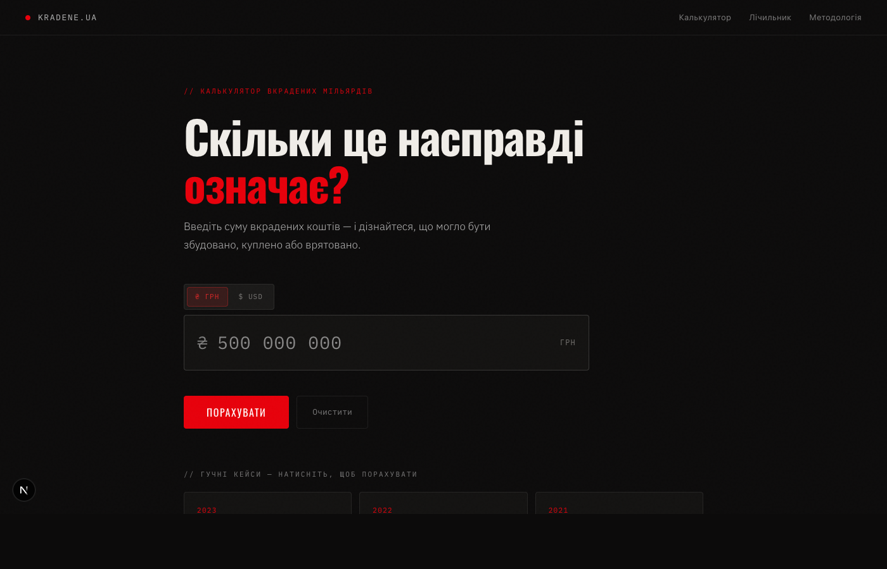

# kradene.ua — Corruption Calculator



> Convert stolen billions into real human losses.

---

## English

### What is this?

**kradene.ua** is a non-commercial social web project. Enter the amount of stolen funds from a corruption case and the calculator converts that abstract number into concrete lost opportunities: bulletproof vests, hospitals, schools, ambulances, apartments.

The goal is to make corruption tangible — to turn billions from headlines into things people actually understand and feel.

**This is NOT a business.** No monetization. No subscriptions. No ads. Pure civic mission.

### Features

- **Calculator** — enter any amount in UAH or USD (live NBU exchange rate), get a breakdown across 19 equivalents
- **5 pre-loaded cases** — click any real corruption case to instantly calculate it
- **Category filters** — Military, Healthcare, Education, Housing, Physical scale
- **SVG visualizations** — dot-matrix of icons showing scale for each equivalent
- **Share** — Telegram, Facebook, Twitter/X share buttons + OG card preview (1200×630)
- **USD/UAH toggle** — values convert automatically when switching currency

### Tech Stack

- **Next.js 15** (App Router) + TypeScript
- **Tailwind CSS**
- **`@vercel/og`** for dynamic OG images
- **Vercel** hosting (free tier)
- No backend. No database. No cookies.

### Data Sources

Every number has a source. No made-up figures.

| Category | Sources |
|----------|---------|
| Military | Повернись живим, Фонд Притули, Dignitas |
| Healthcare | МОЗ України, НСЗУ, Тендерний портал |
| Education | МОН України, Держбуд |
| Housing | ЛУН, OLX |
| Exchange rate | НБУ API (daily, cached 24h) |
| Corruption cases | НАБУ, САП, Bihus.Info, DoZorro |

### Getting Started

```bash
npm install
npm run dev       # http://localhost:3000
npm run build
npm run start
```

### Legal

This project operates on **open data** from official sources. Conclusions about specific individuals are strictly within the scope of official НАБУ, САП investigations and court verdicts. No personal data is collected.

Code: **MIT License** · Data: **CC-BY**

---

## Українська

### Що це таке?

**kradene.ua** — некомерційний соціальний веб-проєкт. Введіть суму вкрадених коштів з будь-якого корупційного кейсу — і калькулятор перетворить абстрактну цифру на конкретні втрачені можливості: бронежилети, лікарні, школи, машини швидкої, квартири.

Мета — зробити корупцію відчутною. Перетворити мільярди із заголовків новин на речі, які людина розуміє і відчуває.

**Це НЕ бізнес.** Жодної монетизації. Жодних підписок. Жодної реклами. Чиста громадянська місія.

### Що вміє

- **Калькулятор** — вводиш суму в гривнях або доларах (курс НБУ в реальному часі), отримуєш розбивку по 19 еквівалентах
- **5 готових кейсів** — клік на реальну корупційну справу і одразу бачиш результат
- **Фільтри по категоріях** — Армія, Медицина, Освіта, Житло, Фізично
- **SVG-візуалізація** — dot-matrix з іконками що показує масштаб
- **Шерінг** — Telegram, Facebook, Twitter/X + превʼю OG-картки 1200×630
- **Перемикач USD/UAH** — значення автоматично конвертується при зміні валюти

### Технічний стек

- **Next.js 15** (App Router) + TypeScript
- **Tailwind CSS**
- **`@vercel/og`** для динамічних OG-картинок
- **Vercel** хостинг
- Без бекенду. Без бази даних. Без cookies.

### Джерела даних

Кожна цифра має джерело. Жодних вигаданих чисел.

| Категорія | Джерела |
|-----------|---------|
| Армія | Повернись живим, Фонд Притули, Dignitas |
| Медицина | МОЗ України, НСЗУ, Тендерний портал |
| Освіта | МОН України, Держбуд |
| Житло | ЛУН, OLX |
| Курс валют | API НБУ (щоденно, кеш 24г) |
| Корупційні кейси | НАБУ, САП, Bihus.Info, DoZorro |

### Запуск

```bash
npm install
npm run dev       # http://localhost:3000
npm run build
npm run start
```

### Правові застереження

Проєкт оперує **відкритими даними** з офіційних джерел. Висновки щодо конкретних осіб — виключно в межах офіційних розслідувань НАБУ, САП та вироків судів. Персональні дані не збираються.

Код: **MIT License** · Дані: **CC-BY**

---

*Якщо знайшли помилку в даних або хочете додати новий кейс — відкрийте [issue](https://github.com/romkravets/skilky.ua/issues) або [pull request](https://github.com/romkravets/skilky.ua/pulls).*
